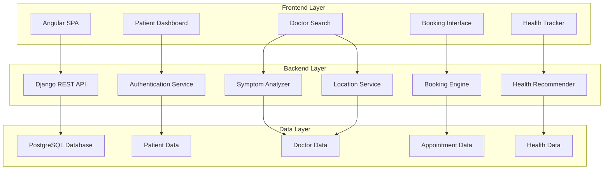
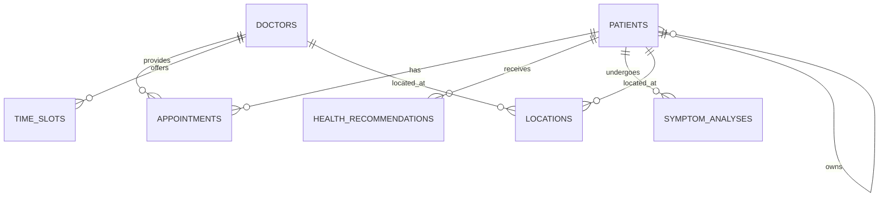

# Design Document: Medical Appointment System

## Overview

The Medical Appointment System is a full-stack web application built with Angular frontend and Django backend, utilizing SQL database for data persistence. The system provides comprehensive healthcare management for both humans and animals, featuring intelligent symptom analysis, location-based doctor recommendations, appointment scheduling, and personalized health tracking.

The architecture follows a service-oriented design with clear separation between presentation, business logic, and data layers. The system integrates multiple specialized services including symptom analysis, location services, booking management, and health recommendations to provide a seamless healthcare experience.

## Architecture

### High-Level Architecture



### Component Architecture

The system is organized into distinct service components:

1. **Authentication Service**: Manages user authentication and authorization
2. **Symptom Analyzer**: Processes symptom input and categorizes medical needs
3. **Location Service**: Handles geographic search and distance calculations
4. **Booking Engine**: Manages appointment scheduling and time slot allocation
5. **Health Recommender**: Generates personalized health and wellness advice
6. **Contact Manager**: Handles communication and contact information
7. **Care Instructions Service**: Manages pre/post appointment guidance

## Components and Interfaces

### Frontend Components (Angular)

#### Patient Dashboard Component
- **Purpose**: Central hub for patient health management
- **Responsibilities**: Display appointments, health metrics, recommendations
- **Interfaces**: 
  - `PatientService` for patient data
  - `AppointmentService` for appointment management
  - `HealthService` for health tracking

#### Symptom Input Component
- **Purpose**: Capture and process patient symptoms
- **Responsibilities**: Symptom collection, validation, analysis triggering
- **Interfaces**:
  - `SymptomAnalyzerService` for symptom processing
  - `DoctorRecommendationService` for specialist suggestions

#### Doctor Search Component
- **Purpose**: Location-based doctor discovery
- **Responsibilities**: Search interface, filtering, results display
- **Interfaces**:
  - `LocationService` for geographic operations
  - `DoctorService` for doctor data retrieval

#### Appointment Booking Component
- **Purpose**: Schedule and manage appointments
- **Responsibilities**: Time slot display, booking confirmation, calendar integration
- **Interfaces**:
  - `BookingService` for appointment operations
  - `TimeSlotService` for availability management

### Backend Services (Django)

#### Symptom Analyzer Service
```python
class SymptomAnalyzerService:
    def analyze_symptoms(self, symptoms: List[str], patient_type: str) -> AnalysisResult
    def categorize_specialty(self, analysis: AnalysisResult) -> List[Specialty]
    def rank_recommendations(self, specialties: List[Specialty]) -> List[Specialty]
```

#### Location Service
```python
class LocationService:
    def validate_location(self, location_input: str) -> LocationData
    def find_doctors_nearby(self, location: LocationData, radius: float) -> List[Doctor]
    def calculate_distance(self, origin: LocationData, destination: LocationData) -> float
```

#### Booking Engine
```python
class BookingEngine:
    def get_available_slots(self, doctor_id: int, date_range: DateRange) -> List[TimeSlot]
    def reserve_slot(self, slot_id: int, patient_id: int) -> ReservationResult
    def confirm_booking(self, reservation_id: int) -> Appointment
    def cancel_appointment(self, appointment_id: int) -> CancellationResult
```

#### Health Recommender Service
```python
class HealthRecommenderService:
    def generate_exercise_plan(self, patient_profile: PatientProfile) -> ExercisePlan
    def suggest_diet_recommendations(self, health_data: HealthData) -> DietPlan
    def calculate_step_goals(self, patient_metrics: PatientMetrics) -> StepGoal
```

## Data Models

### Core Entities

#### Patient Model
```sql
CREATE TABLE patients (
    id SERIAL PRIMARY KEY,
    user_id INTEGER REFERENCES auth_user(id),
    patient_type VARCHAR(20) CHECK (patient_type IN ('human', 'animal')),
    name VARCHAR(100) NOT NULL,
    date_of_birth DATE,
    species VARCHAR(50), -- for animals
    breed VARCHAR(50), -- for animals
    owner_id INTEGER REFERENCES patients(id), -- for animals
    medical_history JSONB,
    emergency_contact JSONB,
    created_at TIMESTAMP DEFAULT CURRENT_TIMESTAMP,
    updated_at TIMESTAMP DEFAULT CURRENT_TIMESTAMP
);
```

#### Doctor Model
```sql
CREATE TABLE doctors (
    id SERIAL PRIMARY KEY,
    user_id INTEGER REFERENCES auth_user(id),
    name VARCHAR(100) NOT NULL,
    specialty VARCHAR(100) NOT NULL,
    doctor_type VARCHAR(20) CHECK (doctor_type IN ('human', 'veterinary')),
    license_number VARCHAR(50) UNIQUE NOT NULL,
    phone VARCHAR(20),
    email VARCHAR(100),
    address JSONB,
    working_hours JSONB,
    rating DECIMAL(3,2) DEFAULT 0.00,
    is_active BOOLEAN DEFAULT TRUE,
    created_at TIMESTAMP DEFAULT CURRENT_TIMESTAMP
);
```

#### Appointment Model
```sql
CREATE TABLE appointments (
    id SERIAL PRIMARY KEY,
    patient_id INTEGER REFERENCES patients(id),
    doctor_id INTEGER REFERENCES doctors(id),
    appointment_datetime TIMESTAMP NOT NULL,
    duration_minutes INTEGER DEFAULT 30,
    status VARCHAR(20) CHECK (status IN ('scheduled', 'confirmed', 'completed', 'cancelled')),
    symptoms JSONB,
    diagnosis JSONB,
    notes TEXT,
    pre_instructions TEXT,
    post_instructions TEXT,
    created_at TIMESTAMP DEFAULT CURRENT_TIMESTAMP,
    updated_at TIMESTAMP DEFAULT CURRENT_TIMESTAMP
);
```

#### Time Slot Model
```sql
CREATE TABLE time_slots (
    id SERIAL PRIMARY KEY,
    doctor_id INTEGER REFERENCES doctors(id),
    slot_datetime TIMESTAMP NOT NULL,
    duration_minutes INTEGER DEFAULT 30,
    is_available BOOLEAN DEFAULT TRUE,
    is_blocked BOOLEAN DEFAULT FALSE,
    created_at TIMESTAMP DEFAULT CURRENT_TIMESTAMP,
    UNIQUE(doctor_id, slot_datetime)
);
```

#### Health Recommendation Model
```sql
CREATE TABLE health_recommendations (
    id SERIAL PRIMARY KEY,
    patient_id INTEGER REFERENCES patients(id),
    recommendation_type VARCHAR(50) CHECK (recommendation_type IN ('exercise', 'diet', 'steps')),
    content JSONB NOT NULL,
    target_metrics JSONB,
    is_active BOOLEAN DEFAULT TRUE,
    created_at TIMESTAMP DEFAULT CURRENT_TIMESTAMP,
    expires_at TIMESTAMP
);
```

### Supporting Entities

#### Symptom Analysis Model
```sql
CREATE TABLE symptom_analyses (
    id SERIAL PRIMARY KEY,
    patient_id INTEGER REFERENCES patients(id),
    symptoms JSONB NOT NULL,
    analysis_result JSONB,
    recommended_specialties JSONB,
    confidence_score DECIMAL(3,2),
    created_at TIMESTAMP DEFAULT CURRENT_TIMESTAMP
);
```

#### Location Data Model
```sql
CREATE TABLE locations (
    id SERIAL PRIMARY KEY,
    entity_type VARCHAR(20) CHECK (entity_type IN ('doctor', 'patient')),
    entity_id INTEGER NOT NULL,
    address_line1 VARCHAR(200),
    address_line2 VARCHAR(200),
    city VARCHAR(100),
    state VARCHAR(50),
    zip_code VARCHAR(20),
    country VARCHAR(50),
    latitude DECIMAL(10,8),
    longitude DECIMAL(11,8),
    created_at TIMESTAMP DEFAULT CURRENT_TIMESTAMP
);
```

## Database Relationships

